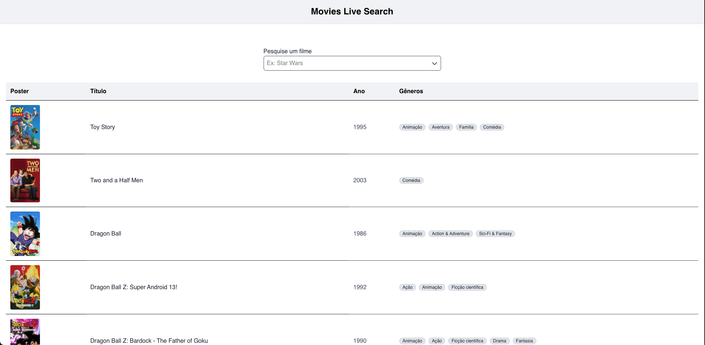
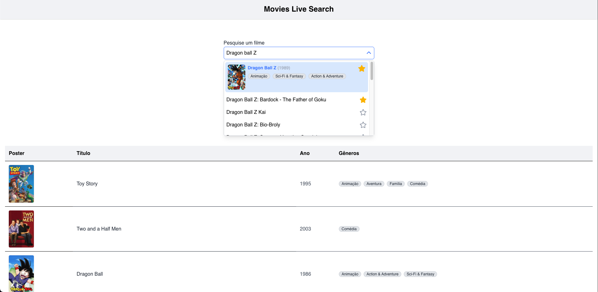

<div align="center" style="margin-bottom: 20px;">
  <h1>
    MOVIES LIVE SEARCH
  </h1>

  <div align="center">
    
    
    
    
  </div>
</div>

## :memo: Sobre o projeto

Este projeto é um desafio de frontend que consiste na construção de um sistema de **busca ao vivo (live search)** utilizando a API do [TMDB](https://www.themoviedb.org/). O usuário pode digitar o nome de um filme ou série e visualizar os resultados em tempo real.

### ✨ Funcionalidades

- 🔍 **Busca dinâmica** por filmes e séries com base no nome digitado
- ⌨️ **Navegação via teclado** (setas para cima/baixo, Enter e atalhos)
- ⭐ **Sistema de favoritos**, com a possibilidade de favoritar/desfavoritar usando atalhos (tecla de espaço)
- 💾 **Persistência de dados no localStorage**, garantindo que os favoritos permaneçam salvos entre sessões
- 🎨 **Input de busca personalizado**, com foco em usabilidade e acessibilidade

### 🛠️ Tecnologias utilizadas

- ⚡ [Vite](https://vitejs.dev/) – para bundling e desenvolvimento rápido
- ⚛️ [React.js](https://reactjs.org/) – biblioteca principal para construção da interface
- 🟨 [TypeScript](https://www.typescriptlang.org/) – para tipagem estática e maior robustez no código
- 📦 Outras bibliotecas e ferramentas para estilização, requisições e gerenciamento de estado

## :cyclone: Rodar esse projeto

### Ambiente local

```bash
# Clonar repositorio
$ git clone https://github.com/jefferson1104/movies-live-search.git

# Navegar para o diretorio do projeto
$ cd movies-live-search

# Instalar dependencias
$ npm install

# Crie um .env com sua API KEY do TMDB, caso nao tenha, acesse
https://developer.themoviedb.org/docs/getting-started

# Voce pode rodar ele sem um container docker direto na maquina local
$ npm run dev

# Abra no navegador
http://localhost:5173

# Caso tenha docker pode executar com o build de desevolvimento
$ docker-compose -f docker-compose.dev.yml up --build

```

**ATENCAO:** Depois de rodar uma vez o build voce pode apenas executar o comando abaixo para as proximas vezes que for executar o projeto

```bash
$ docker-compose -f docker-compose.dev.yml up
```

## 🎨 Screenshots

<div>
  
  
</div>
